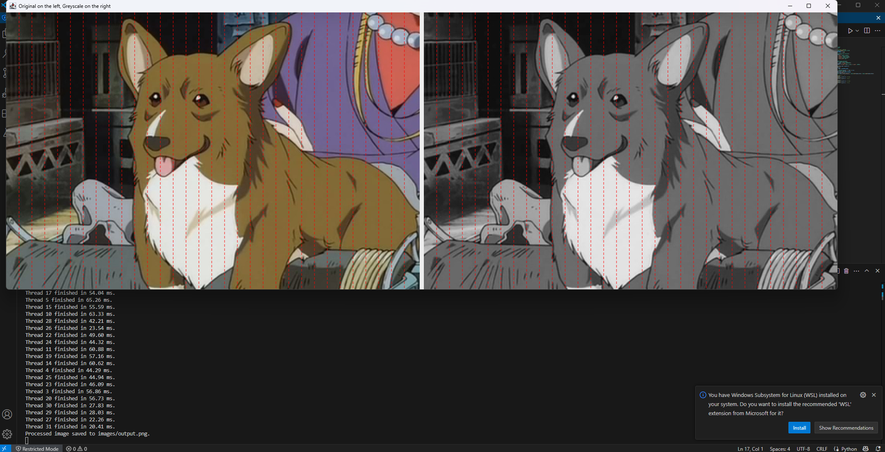

# Java Parallel Image Processor

## Project Overview
This is a Java desktop application built as part of the **CS4440 Final Project**. It demonstrates multithreading and parallel image processing concepts through a simple but effective GUI.

### Features
- Upload and select sample images (e.g., dog, cat, bird)
- Apply a grayscale filter (more filters may be added)
- Split the image into sections processed by multiple threads
- Compare thread execution times (printed to console)
- Display original and processed images side by side with thread divisions
- Displays thread time for each image strip

---

## Project Structure


```
JavaParallelImageProcessor/
├── images/ # Folder to hold sample images (dog.png, cat.png, etc.)
├── src/ # Java source code
│ ├── Main.java # Program entry point + multithreaded processing logic
│ ├── Utils.java # Image loading/saving functions
│ ├── ImageWithGrid.java # Custom JPanel to draw image + grid lines
├── .gitignore # Ignore compiled class files, IDE configs
└── README.md # You're reading it
```

---


---

## ⚙️ How to Run

1. Clone or download this repo
2. Open terminal in project root
3. Compile:
   ```
   javac -d out src/*.java
   ```
4. Run:
   ```
   java -cp out Main
   ```

---

## Concepts Used

- Java Multithreading (`Thread`)
- Java Swing GUI (`JFrame`, `JPanel`)
- Image manipulation with `BufferedImage`
- Performance measurement with `System.nanoTime()`

---

## Completed Task
- Set up basic file structure
- Implement image loading and saving (`Utils.java`)
- Add grayscale filter
- Process image in parallel by sections
- Compare thread execution times in console
- Display original + filtered image side-by-side
- Upload sample images to `/images/`

## 📸 Sample Screenshots




---

## 👨‍💻 Authors

- Brian Becerra  
- Haonan Ma  
- Adan Trejo

- Course: CS4440 Final Project - Java Multithreading
